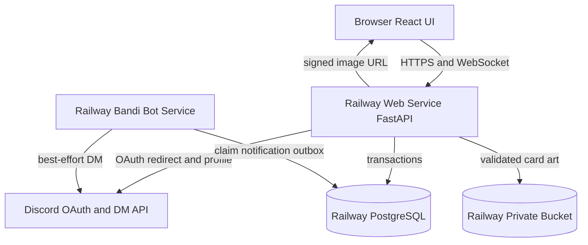
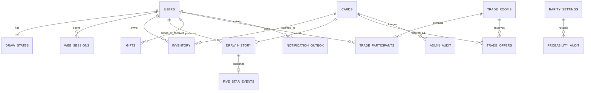
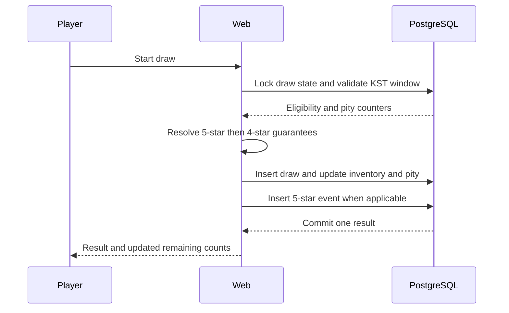
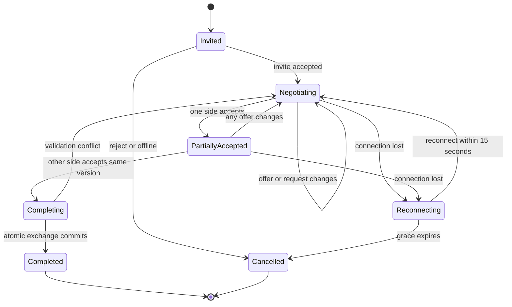

# feat: Build Youngho Gacha site

## Summary

기존 반디봇을 유지하면서 같은 저장소에 Discord OAuth 기반 카드 웹서비스를 추가한다. 웹과 봇은 Railway에서 별도 서비스로 실행하고 PostgreSQL, Railway Bucket, 트랜잭션 아웃박스를 통해 뽑기·수집·실시간 거래·DM 알림을 일관되게 연결한다.

---

## Problem Frame

현재 저장소는 `Firefly.py`가 시작하는 단일 Discord 봇과 JSON 파일 기반 메모리 저장소로 구성되어 있다. 웹 인증, 관계형 데이터, 이미지 저장, 브라우저 UI, 실시간 양방향 연결을 위한 기반은 없으며 기존 JSON 저장 방식은 동시 뽑기와 카드 교환의 원자성을 보장할 수 없다.

새 사이트는 Discord 서버와 무관한 전역 계정 및 자산을 제공해야 한다. 동시에 기존 봇의 대화·메모리 기능과 배포를 깨뜨리지 않고, 웹에서 완료된 행동이 Discord DM 실패 때문에 취소되지 않도록 두 런타임의 경계를 분명히 해야 한다.

---

## Requirements

원본 요구사항의 R1-R68이 제품 동작의 기준이며, 아래 표는 구현 책임을 묶어 보여준다.

| Origin IDs | Implementation outcome | Primary units |
|---|---|---|
| R1-R8, R69 | Discord OAuth, 전역 계정, 최초 경고, 관리자 판별, 등록 사용자 검색과 Discord 프로필 동기화 | U3, U9 |
| R9-R22 | KST 일일 뽑기, 4·5성 천장, 가중치, 개인별 확률, 원자적 지급 | U2, U5 |
| R23-R34 | 카드 메타데이터, 등급 시각 체계, 중복 수량, YP, 접근 가능한 연출 | U4, U5, U6 |
| R35-R40 | 전역 YP 랭킹, 프로필 진입, 최근 5성 피드와 과거 조회 | U5, U6 |
| R41-R45 | 수신 설정과 오프라인 즉시 선물 | U7 |
| R46-R55 | 온라인 판별, 실시간 거래방, 요청·수락·거절, 카드 예약, 원자적 교환 | U8 |
| R56-R59 | 웹 실시간 초대와 반디봇의 비차단성 DM 링크 | U8, U9 |
| R60-R68 | 단일 관리자 UI, 카드·확률 관리, 삭제 영향 미리보기, 내부 감사 | U4 |

**Quality requirements**

- Q1. 모든 자산 변경은 재시도나 동시 요청이 있어도 한 번만 적용되어야 한다.
- Q2. 로그인 세션과 변경 요청은 OAuth 위조, 세션 탈취, CSRF에 대한 기본 방어를 갖춰야 한다.
- Q3. 플레이어 기능은 모바일과 데스크톱에서 Discord 명령 없이 완료되어야 한다.
- Q4. 기존 반디봇의 JSON 메모리와 명령 동작은 카드 사이트 도입으로 변경되지 않아야 한다.
- Q5. 배포 전 자동 검증은 Python 단위·통합 테스트, 프런트엔드 테스트, PostgreSQL 동시성 테스트, 핵심 브라우저 흐름을 포함해야 한다.

**Resolved during planning**

- 원본의 재연결 질문은 웹 프로세스가 살아 있는 동안 15초 유예하는 것으로 확정한다. 이는 AE8의 즉시 연결 종료 표현을 대체하며, 명시적인 나가기와 거절은 계속 즉시 방을 종료한다.
- 원본의 이미지 질문은 최대 10MB PNG/JPEG/WebP, 관리자 3:4 자르기, WebP 정규화 저장, 원본 미보관으로 확정한다.

---

## Key Technical Decisions

- **Separate Railway services from one repository:** 봇과 웹을 각각 독립 프로세스로 배포한다. 봇 장애가 웹을 내리지 않고 웹 배포가 Discord 연결을 재시작하지 않게 한다.
- **Single-origin FastAPI and React application:** FastAPI가 API, OAuth 콜백, WebSocket, 빌드된 React 정적 파일을 같은 도메인에서 제공한다. 별도 프런트엔드 도메인과 CORS 복잡성을 피한다.
- **PostgreSQL as the card-domain authority:** 계정, 카드, 인벤토리, 천장, 거래, 선물, 감사, 알림 아웃박스를 PostgreSQL에 둔다. `firefly/storage.py`의 JSON 메모리는 봇 대화 도메인에만 남긴다.
- **Derived YP instead of a cached balance:** 랭킹 YP는 수량이 1 이상인 고유 카드 종류의 현재 YP 합으로 계산한다. 카드 YP 수정과 마지막 장 이전이 별도 보정 작업 없이 즉시 반영된다.
- **Locked and idempotent mutations:** 뽑기, 선물, 거래 완료, 카드 삭제는 관련 사용자 행을 Discord ID 순서로, 인벤토리 행을 카드 ID 순서로 잠근 뒤 하나의 트랜잭션에서 처리한다. 일일 뽑기 창과 완료 작업에는 고유 제약을 두고, 클라이언트 재시도에는 작업별 idempotency key를 적용한다.
- **Deterministic pity precedence:** 90회째에는 5성을 강제하고, 그 전에는 현재 5성 확률을 먼저 평가한다. 5성이 아니면서 4성 보장 회차이면 4성을 강제하고, 나머지는 관리 확률로 추첨한다.
- **Pity probability redistribution:** 소프트 천장으로 5성 확률이 올라가면 남은 확률 질량을 1~4성의 관리자 설정 비율대로 정규화한다. 4성 보장 회차에서는 5성 판정이 실패한 경우에만 4성을 강제한다.
- **Server-side web sessions:** OAuth Authorization Code 흐름에 일회용 state와 PKCE를 사용한다. 브라우저에는 무작위 세션 식별자만 Secure·HttpOnly·SameSite 쿠키로 저장하고 변경 요청은 CSRF 토큰으로 검증한다. 세션은 30일 비활성 또는 90일 절대 만료를 적용하고 로그아웃 시 즉시 폐기한다.
- **WebSocket handshake protection:** 허용 Origin을 검증하고, CSRF 보호 HTTP 요청으로 발급한 60초 단일 사용 연결 티켓을 세션 쿠키와 함께 확인한다.
- **Immutable draw history snapshots:** 영구 삭제된 카드는 공개 5성 피드와 보유 자산에서 제거하지만 내부 뽑기 기록은 당시 카드명·등급·YP 스냅샷과 nullable 카드 참조로 보존한다.
- **Private Railway Bucket for card art:** 관리자가 자른 이미지만 검증·정규화하여 저장하고, 짧은 수명의 서명 URL로 브라우저에 전달한다. 원본 파일과 임의 외부 URL은 보관하지 않는다.
- **Single web replica for the first release:** 온라인 상태와 WebSocket fan-out은 웹 프로세스 안에서 관리한다. PostgreSQL이 카드 예약과 완료 상태를 보장하며 15초 재접속 유예 뒤 세션을 취소한다.
- **Transactional notification outbox:** 웹의 성공 트랜잭션이 DM 작업을 함께 기록하고 반디봇이 이를 폴링한다. 전달은 최소 한 번 방식이므로 Discord 전송 직후 봇이 종료되면 같은 DM이 다시 갈 수 있다. DM 실패나 드문 중복은 운영 상태로 남지만 이미 완료된 선물이나 거래를 되돌리지 않는다.

---

## High-Level Technical Design

### Component topology



웹과 봇은 서로의 공개 API를 직접 호출하지 않는다. PostgreSQL의 내구성 있는 상태와 알림 아웃박스가 두 서비스의 유일한 결합 지점이다.

### Persistent data relationships



인벤토리는 사용자·카드 조합당 한 행을 유지하고 `quantity`와 `reserved_quantity`를 분리한다. YP 합계는 인벤토리와 현재 카드 값을 조인해 계산하며 별도 잔액 열을 두지 않는다.

### Atomic daily draw



동일 KST 창에 대한 중복 요청은 사용자별 잠금과 고유 제약에서 하나만 성공한다. 클라이언트 애니메이션은 커밋된 결과를 표현할 뿐 결과를 결정하지 않는다.

### Live trade lifecycle



거래 제안 변경마다 제안 버전을 올리고 양쪽 수락을 지운다. 완료 트랜잭션은 해당 버전과 예약 수량을 다시 확인해 오래된 수락이나 중복 완료를 거절한다.

---

## Output Structure

```text
bandi_cards/
  app.py
  config.py
  db.py
  models/
  routes/
  services/
  realtime/
  static/
web/
  package.json
  src/
    api/
    components/
    pages/
    styles/
  e2e/
alembic/
tests/
  bandi_cards/
firefly/
  card_notifications.py
Dockerfile.web
railpack.json
```

`bandi_cards/`는 웹 백엔드와 도메인 서비스, `web/`은 React 소스, `firefly/`는 기존 봇에 추가되는 아웃박스 소비자만 소유한다.

---

## Implementation Units

### U1. Web platform and deployment scaffold

- **Goal:** 같은 도메인에서 React UI, FastAPI API, OAuth 콜백, WebSocket을 제공할 수 있는 웹 런타임과 Railway 배포 골격을 만든다.
- **Requirements:** Q1-Q5; origin R1, R34 and success criteria
- **Dependencies:** None
- **Files:** `requirements-web.txt`, `bandi_cards/__init__.py`, `bandi_cards/app.py`, `bandi_cards/config.py`, `bandi_cards/static/`, `web/package.json`, `web/vite.config.ts`, `web/src/main.tsx`, `Dockerfile.web`, `railpack.json`, `.env.example`, `tests/bandi_cards/test_app.py`, `tests/bandi_cards/test_config.py`
- **Approach:** 기존 `requirements.txt`와 봇 시작 명령은 보존하고 웹 전용 의존성을 분리한다. 다단계 웹 이미지는 React를 빌드한 뒤 FastAPI가 결과물을 제공하며 Railway의 `PORT`와 건강 확인 경로를 사용한다.
- **Patterns to follow:** `firefly/config.py`의 명시적 환경 변수 검증과 `railpack.json`의 단순 시작 경계를 따른다.
- **Test scenarios:**
  - 필수 웹 환경 변수가 없거나 잘못된 경우 시작 전에 명확히 실패한다.
  - 건강 확인은 데이터베이스 준비 상태와 프로세스 생존 상태를 구분한다.
  - 알려지지 않은 브라우저 경로는 React 앱으로 돌아가지만 API 경로 오류는 정적 앱으로 삼켜지지 않는다.
  - 기존 봇 테스트 환경은 웹 전용 비밀값 없이 계속 import되고 실행된다.
- **Verification:** 로컬과 Railway형 컨테이너에서 웹 정적 화면과 API 건강 확인이 같은 포트로 제공되고 봇 시작 경로는 변하지 않는다.

### U2. PostgreSQL schema and transaction foundation

- **Goal:** 카드 도메인의 모든 내구성 있는 상태와 동시성 제약을 관계형 모델과 마이그레이션으로 정의한다.
- **Requirements:** Origin R2, R9-R22, R27-R30, R38-R45, R46-R55, R60-R69; Q1
- **Dependencies:** U1
- **Files:** `bandi_cards/db.py`, `bandi_cards/models/__init__.py`, `bandi_cards/models/accounts.py`, `bandi_cards/models/cards.py`, `bandi_cards/models/draws.py`, `bandi_cards/models/transfers.py`, `bandi_cards/models/trades.py`, `bandi_cards/models/audit.py`, `alembic.ini`, `alembic/env.py`, `alembic/versions/`, `tests/bandi_cards/test_models.py`, `tests/bandi_cards/test_migrations.py`, `tests/bandi_cards/test_database_constraints.py`
- **Approach:** SQLAlchemy 2와 Alembic을 사용해 사용자, 세션, 카드, 등급 설정, 인벤토리, 천장, 뽑기 기록, 5성 이벤트, 선물, 거래, 감사, 알림 아웃박스를 정의한다. 사용자·카드 인벤토리와 사용자·KST 뽑기 창에는 고유 제약을 두고 모든 시간은 UTC로 저장한다.
- **Execution note:** 먼저 PostgreSQL 통합 테스트로 고유 제약과 잠금 충돌을 고정한 뒤 모델을 구현한다.
- **Patterns to follow:** `firefly/storage.py`의 원자적 저장 의도를 유지하되 파일 잠금 대신 데이터베이스 트랜잭션과 제약으로 승격한다.
- **Test scenarios:**
  - 초기 마이그레이션과 빈 데이터베이스 업그레이드가 기본 1~5성 확률을 정확히 생성한다.
  - 동일 사용자·카드의 중복 인벤토리 행과 동일 KST 창의 중복 뽑기 행이 거절된다.
  - 수량과 예약 수량이 음수가 되거나 예약 수량이 총수량을 넘는 상태가 거절된다.
  - 마이그레이션을 재실행해도 데이터와 기본 설정이 중복되지 않는다.
  - PostgreSQL 행 잠금이 같은 인벤토리를 바꾸는 두 트랜잭션을 직렬화한다.
  - 두 사용자가 서로 반대 방향의 선물·거래를 동시에 실행해도 사용자 ID와 카드 ID 잠금 순서가 교착 없이 완료되며 총수량이 보존된다.
- **Verification:** 새 데이터베이스가 한 번의 마이그레이션 경로로 준비되고 모든 카드 도메인 불변식이 DB 제약 또는 트랜잭션 테스트로 증명된다.

### U3. Discord OAuth, sessions, accounts, and discovery

- **Goal:** 비밀번호 없는 Discord 로그인, 안전한 웹 세션, 최초 경고, 전역 계정 검색과 단일 관리자 권한을 제공한다.
- **Requirements:** Origin R1-R8, R35-R37, R41-R42, R69; Q2-Q3; origin F1, AE6
- **Dependencies:** U1, U2
- **Files:** `bandi_cards/security.py`, `bandi_cards/services/discord_oauth.py`, `bandi_cards/services/sessions.py`, `bandi_cards/services/accounts.py`, `bandi_cards/routes/auth.py`, `bandi_cards/routes/accounts.py`, `bandi_cards/routes/settings.py`, `web/src/pages/LoginPage.tsx`, `web/src/pages/FirstLoginWarningPage.tsx`, `web/src/pages/ProfilePage.tsx`, `web/src/pages/SettingsPage.tsx`, `web/src/components/UserSearch.tsx`, `tests/bandi_cards/test_auth.py`, `tests/bandi_cards/test_sessions.py`, `tests/bandi_cards/test_accounts.py`, `web/src/pages/LoginPage.test.tsx`, `web/src/components/UserSearch.test.tsx`
- **Approach:** Discord에는 `identify`만 요청하고 OAuth 토큰은 프로필 갱신 후 폐기한다. 로그인 성공 시 username·global name·avatar를 즉시 갱신하고 마지막 동기화 시각을 저장한다. 세션 식별자는 해시해 DB에 저장하고 로그인·로그아웃 때 회전한다. HTTP 변경 요청은 CSRF를 검증하고 WebSocket은 Origin·단일 사용 연결 티켓·세션을 함께 검증한다.
- **Execution note:** OAuth 콜백과 관리자 경계에 실패 테스트를 먼저 둔다.
- **Patterns to follow:** 기존 `SPECIAL_USER_ID`를 관리자 판별의 단일 원천으로 사용하고 `firefly/commands.py`의 특수 사용자 권한 의미를 유지한다.
- **Test scenarios:**
  - 유효한 OAuth state와 PKCE로 처음 로그인하면 전역 계정이 생기고 경고 확인 전에는 앱 기능이 차단된다.
  - state 불일치, 재사용된 콜백, Discord 토큰 교환 실패는 세션을 만들지 않는다.
  - 재로그인은 같은 Discord ID의 계정을 갱신하며 자산과 천장을 보존한다.
  - Discord 사용자명·전역 표시 이름·아바타 변경 뒤 로그인하면 동일 계정의 프로필만 갱신되고 검색·랭킹·프로필·5성 피드가 최신 값을 표시한다.
  - 세션은 30일 비활성 또는 90일 절대 만료 뒤 거절되고 로그아웃한 세션과 재사용된 WebSocket 티켓은 즉시 거절된다.
  - Secure·HttpOnly·SameSite 세션 속성과 CSRF 검증이 변경 요청에 적용된다.
  - 관리자 ID가 아닌 사용자는 직접 URL과 API 요청 모두에서 관리자 기능을 사용할 수 없다.
  - 사용자명·표시 이름·숫자 ID 검색은 등록 계정만 반환하고 중복 이름은 구분 가능한 목록으로 나온다.
  - 수신 설정은 새 계정에서 모두 켜져 있고 각각 독립적으로 변경된다.
- **Verification:** Discord 서버 목록이나 비밀번호 없이 로그인·재로그인·검색·설정·관리자 차단 흐름이 API와 UI에서 일관되게 작동한다.

### U4. Card catalog, probabilities, assets, and administration

- **Goal:** 관리자가 카드와 확률을 안전하게 운영하고 Railway Bucket의 정규화된 이미지 자산을 관리하게 한다.
- **Requirements:** Origin R11-R12, R19-R26, R60-R68; origin F5, AE10-AE12
- **Dependencies:** U2, U3
- **Files:** `bandi_cards/services/card_catalog.py`, `bandi_cards/services/probabilities.py`, `bandi_cards/services/card_assets.py`, `bandi_cards/routes/admin_cards.py`, `bandi_cards/routes/admin_probabilities.py`, `bandi_cards/routes/assets.py`, `web/src/pages/admin/CardListPage.tsx`, `web/src/pages/admin/CardEditorPage.tsx`, `web/src/pages/admin/ProbabilityPage.tsx`, `web/src/components/ImageCropper.tsx`, `tests/bandi_cards/test_card_catalog.py`, `tests/bandi_cards/test_probabilities.py`, `tests/bandi_cards/test_card_assets.py`, `tests/bandi_cards/test_admin_routes.py`, `web/src/pages/admin/CardEditorPage.test.tsx`
- **Approach:** 최대 10MB PNG·JPEG·WebP만 허용하고 관리자 3:4 미리보기 결과를 서버에서 다시 검증해 WebP로 저장한다. 등급 확률 합계와 활성 카드 풀을 함께 검증하고 변경 전후 값을 감사 기록에 남긴다.
- **Execution note:** 영구 삭제와 확률 변경은 영향 미리보기와 실행 사이의 경쟁 조건 테스트를 먼저 작성한다.
- **Patterns to follow:** 기존 설정 헬퍼의 범위 검증 방식과 관리자 전용 명령의 deny-by-default 권한 방식을 따른다.
- **Test scenarios:**
  - 정상 이미지가 3:4 WebP로 저장되고 잘못된 MIME, 손상 이미지, 10MB 초과 파일은 버킷 쓰기 전에 거절된다.
  - 이미지 교체가 성공한 뒤 이전 객체를 정리하며 실패 시 기존 카드 이미지를 보존한다.
  - 확률 합계가 100%가 아니거나 확률이 있는 등급에 활성 카드가 없으면 설정을 적용하지 않는다.
  - 카드별 가중치가 없으면 동일 확률이고 양수 가중치가 있으면 정규화된 최종 확률을 반환한다.
  - 뽑기 제외는 기존 인벤토리·YP·거래 가능성을 보존한다.
  - 영구 삭제 미리보기 뒤 카드 이름이 불일치하면 실행되지 않는다.
  - 영구 삭제는 관련 거래방을 취소하고 인벤토리·제안·랭킹·5성 피드에서 카드를 제거한다.
  - 영구 삭제 뒤 내부 뽑기 기록은 카드 스냅샷으로 조회 가능하고 삭제된 카드 상세로 연결되지 않는다.
  - YP 수정 직후 해당 카드를 가진 모든 사용자의 조회 랭킹이 새 값을 반영한다.
- **Verification:** 관리자는 파일 수정 없이 카드 풀과 확률을 운영할 수 있고 모든 파괴적 변경은 권한·검증·감사·원자성 경계를 통과한다.

### U5. Draw engine, collection, ranking, and five-star feed

- **Goal:** KST 일일 뽑기와 천장 계산을 원자적으로 실행하고 인벤토리·개인 확률·전역 랭킹·5성 피드를 제공한다.
- **Requirements:** Origin R9-R22, R27-R30, R35-R40; origin F2, AE1-AE5, AE11
- **Dependencies:** U2, U4
- **Files:** `bandi_cards/services/draw_window.py`, `bandi_cards/services/draw_engine.py`, `bandi_cards/services/collections.py`, `bandi_cards/services/rankings.py`, `bandi_cards/services/five_star_feed.py`, `bandi_cards/routes/draws.py`, `bandi_cards/routes/collections.py`, `bandi_cards/routes/rankings.py`, `bandi_cards/routes/feed.py`, `tests/bandi_cards/test_draw_window.py`, `tests/bandi_cards/test_draw_engine.py`, `tests/bandi_cards/test_draw_concurrency.py`, `tests/bandi_cards/test_collections.py`, `tests/bandi_cards/test_rankings.py`, `tests/bandi_cards/test_feed.py`
- **Approach:** KST 05:00을 경계로 논리적 날짜를 계산하고 사용자 천장 행을 잠근 뒤 결과를 결정한다. 5성 하드·소프트 천장, 4성 보장, 기본 등급 확률, 등급 내 카드 가중치를 같은 순서로 계산하며 서버에서 선택한 결과만 저장한다.
- **Execution note:** 확률 함수는 순수 함수로 먼저 고정하고 실제 지급은 PostgreSQL 통합 테스트로 확장한다.
- **Patterns to follow:** `firefly/news.py`의 KST 시간 계산과 순수 로직·외부 효과 분리 테스트 관례를 따른다.
- **Test scenarios:**
  - **Covers AE1.** 04:59 KST 뽑기 후 05:00 KST에 정확히 한 번 다시 뽑을 수 있고 미사용 횟수는 쌓이지 않는다.
  - **Covers AE2.** 4성 이상이 아홉 번 나오지 않으면 열 번째 결과는 4성 이상이며 해당 카운터가 초기화된다.
  - **Covers AE3.** 74회째 6.6%에서 시작해 89회째 96.6%, 90회째 100%가 된다.
  - 소프트 천장 구간에서 5성 확률을 제외한 나머지는 현재 1~4성 설정 비율대로 정규화되고 전체 카드 확률 합은 100%다.
  - **Covers AE4.** 5성 결과는 4성·5성 카운터를 모두 초기화하고 남은 횟수 응답을 갱신한다.
  - 동시에 들어온 같은 사용자의 두 뽑기 요청 중 하나만 카드와 기록을 생성한다.
  - 네트워크 재시도로 같은 idempotency key가 반복되면 최초 결과를 되돌려주고 새 난수 결과나 인벤토리 행을 만들지 않는다.
  - 관리자 가중치와 현재 천장을 반영한 카드별 최종 확률 합이 100%가 된다.
  - **Covers AE5.** 같은 카드 다섯 장의 YP는 한 번만 합산되고 마지막 장이 사라질 때만 감소한다.
  - 동점 랭킹은 안정적인 보조 정렬을 사용하고 페이지 이동 중 중복·누락이 없다.
  - 5성 피드는 최근 20건과 과거 페이지를 KST 표시로 나누고 삭제된 카드 이벤트를 노출하지 않는다.
- **Verification:** 확률·천장·일일 제한이 결정론적 테스트로 검증되고 실제 지급과 랭킹이 경쟁 요청에도 일치한다.

### U6. Player UI, card visuals, and reveal animations

- **Goal:** 모바일과 데스크톱에서 뽑기, 인벤토리, 확률, 랭킹, 프로필, 5성 피드를 완성하고 등급별 연출을 접근 가능하게 제공한다.
- **Requirements:** Origin R18, R20, R23-R40; Q3; origin AE12
- **Dependencies:** U3, U4, U5
- **Files:** `web/src/api/client.ts`, `web/src/styles/tokens.css`, `web/src/styles/rarities.css`, `web/src/components/Card.tsx`, `web/src/components/RarityStars.tsx`, `web/src/components/PityStatus.tsx`, `web/src/components/DrawReveal.tsx`, `web/src/components/FiveStarFeed.tsx`, `web/src/pages/DrawPage.tsx`, `web/src/pages/InventoryPage.tsx`, `web/src/pages/ProbabilityPage.tsx`, `web/src/pages/RankingPage.tsx`, `web/src/pages/FiveStarHistoryPage.tsx`, `web/src/components/Card.test.tsx`, `web/src/components/DrawReveal.test.tsx`, `web/src/pages/DrawPage.test.tsx`, `web/src/pages/RankingPage.test.tsx`
- **Approach:** 등급 색은 중앙 디자인 토큰으로 관리하고 별 개수·텍스트를 함께 사용한다. 1~3성, 4성, 5성 연출을 별도 상태로 구성하되 결과 데이터는 애니메이션 전에 이미 확정하며 건너뛰기와 OS 모션 감소 설정을 즉시 반영한다.
- **Patterns to follow:** 첨부된 워프 트래커 참고 이미지의 빛나는 별 표현과 요구사항의 등급별 테두리 위계를 따르되 외부 이미지 자산은 복사하지 않는다.
- **Test scenarios:**
  - 1~5성 카드가 테두리 색, 별 개수, 텍스트 등급으로 각각 구분된다.
  - 1~3성은 짧은 일반 공개, 4성은 보라색 폭발, 5성은 황금 워프 상태를 거쳐 같은 서버 결과를 표시한다.
  - 건너뛰기는 결과를 바꾸거나 중복 API 요청을 만들지 않는다.
  - **Covers AE12.** 모션 감소 환경에서는 5성 구분을 유지하면서 이동과 번쩍임을 최소화한다.
  - 천장 남은 횟수와 현재 카드별 확률이 뽑기 후 즉시 갱신된다.
  - 모바일 너비에서 카드, 랭킹, 피드, 관리자 진입을 가로 스크롤 없이 사용할 수 있다.
  - 키보드와 스크린리더로 뽑기 결과, 별 등급, 버튼 상태를 인식할 수 있다.
- **Verification:** 주요 화면의 반응형·키보드·모션 감소 테스트와 시각 검토가 통과하며 색만으로 등급을 전달하지 않는다.

### U7. Immediate gifts

- **Goal:** 등록 사용자에게 중복 카드 일부 또는 전부를 즉시 선물하고 양쪽 YP와 DM 아웃박스를 원자적으로 갱신한다.
- **Requirements:** Origin R29-R30, R37, R41-R45, R56-R58; origin F3, AE5-AE6, AE9
- **Dependencies:** U2, U3, U5
- **Files:** `bandi_cards/services/gifts.py`, `bandi_cards/services/notification_outbox.py`, `bandi_cards/routes/gifts.py`, `web/src/components/GiftDialog.tsx`, `web/src/components/GiftDialog.test.tsx`, `tests/bandi_cards/test_gifts.py`, `tests/bandi_cards/test_gift_concurrency.py`, `tests/bandi_cards/test_notification_outbox.py`
- **Approach:** 발신자·수신자·인벤토리를 고정 순서로 잠그고 미예약 수량만 전송한다. 확인 화면은 양쪽 YP 변화 여부를 서버 미리보기로 보여주며 최종 요청에는 재전송 방지 키를 사용한다.
- **Execution note:** 마지막 장, 예약 카드, 동시 선물 경쟁 테스트를 먼저 작성한다.
- **Patterns to follow:** 봇의 DM 실패 처리처럼 외부 전송 실패를 도메인 성공과 분리한다.
- **Test scenarios:**
  - 온라인·오프라인 수신자 모두 허용 설정이 켜져 있으면 즉시 카드를 받는다.
  - 선물 수신을 끈 사용자는 미리보기와 실행 모두에서 대상이 되지 않는다.
  - 보유량보다 많거나 거래 예약 중인 수량을 포함한 선물은 아무 변화 없이 실패한다.
  - 같은 최종 요청이 재전송되어도 선물은 한 번만 적용된다.
  - **Covers AE5.** 마지막 장 여부에 따라 양쪽 파생 YP가 정확히 변한다.
  - 선물 커밋과 DM 아웃박스 생성이 함께 성공하거나 함께 롤백된다.
- **Verification:** 모든 경계 수량과 동시 요청에서 카드 총량이 보존되고 수신자 승인 없이 한 번만 전달된다.

### U8. Presence and live bilateral trades

- **Goal:** 온라인 사용자만 초대할 수 있는 실시간 거래방과 말랑이식 협상·수락·거절 흐름을 구현한다.
- **Requirements:** Origin R37, R41-R42, R46-R55, R59; origin F4, AE6-AE9
- **Dependencies:** U2, U3, U5, U7
- **Files:** `bandi_cards/realtime/connection_manager.py`, `bandi_cards/realtime/messages.py`, `bandi_cards/services/trades.py`, `bandi_cards/routes/realtime.py`, `bandi_cards/routes/trades.py`, `web/src/realtime/socket.ts`, `web/src/pages/TradeRoomPage.tsx`, `web/src/components/TradeOffer.tsx`, `web/src/components/TradeRequestControls.tsx`, `web/src/pages/TradeRoomPage.test.tsx`, `tests/bandi_cards/test_presence.py`, `tests/bandi_cards/test_trade_state.py`, `tests/bandi_cards/test_trade_concurrency.py`, `tests/bandi_cards/test_trade_websocket.py`
- **Approach:** 인증된 WebSocket 연결 수로 온라인 상태를 계산하고 한 사용자의 여러 탭을 하나의 presence로 묶는다. 거래방과 예약은 DB에 기록하고 제안 버전과 수락 버전을 비교하며, 연결 손실 시 15초 동안 방과 예약을 유지한다.
- **Execution note:** 상태 머신과 원자적 완료 테스트를 먼저 고정한 뒤 WebSocket 전달을 붙인다.
- **Patterns to follow:** FastAPI의 인증 의존성을 HTTP와 WebSocket에서 공유하고 기존 봇의 asyncio 작업 취소 처리 방식을 따른다.
- **Test scenarios:**
  - 오프라인이거나 거래 수신을 끈 사용자는 검색·랭킹 프로필에서 거래 초대를 받을 수 없다.
  - 온라인 대상에게 초대하면 사이트 실시간 초대가 도착하고 수락 시 같은 거래방 상태를 본다.
  - 일반 추가 요청과 특정 카드·수량 요청은 상대 제안을 자동 변경하지 않는다.
  - **Covers AE7.** 어느 쪽이든 제안을 바꾸면 양쪽 수락이 해제되고 새 버전에 다시 수락해야 한다.
  - 서로 다른 거래방이 같은 카드 수량을 예약하려 할 때 가용 수량을 넘는 예약은 실패한다.
  - **Covers AE8.** 15초 안에 재접속하면 협상을 이어가고, 유예가 끝나면 방이 취소되어 예약이 풀린다.
  - 동시에 도착한 양쪽 완료 요청은 정확히 한 번만 교환하고 카드 총량을 보존한다.
  - 웹 프로세스가 거래 도중 종료되면 재시작 정리 작업이 모든 미완료 방을 취소하고 예약을 해제한다. 15초 유예는 프로세스가 살아 있는 일반 연결 단절에만 적용한다.
  - 초대 전송과 동시에 대상의 마지막 탭이 끊기면 방을 활성화하지 않고 초대 실패 또는 취소 상태를 양쪽에 일관되게 보여준다.
- **Verification:** 여러 동시 거래방과 다중 탭에서도 presence·예약·수락 버전이 일치하고 완료 또는 취소 뒤 고아 예약이 남지 않는다.

### U9. Bandi notification outbox and profile-sync consumer

- **Goal:** 반디봇이 웹 알림을 안전하게 처리하고 등록 사용자의 최신 Discord 프로필을 서버 멤버십과 무관하게 동기화한다.
- **Requirements:** Origin R56-R59, R69; Q4; origin AE9
- **Dependencies:** U2, U7, U8
- **Files:** `firefly/card_notifications.py`, `firefly/discord_profiles.py`, `firefly/config.py`, `Firefly.py`, `.env.example`, `tests/test_card_notifications.py`, `tests/test_discord_profiles.py`, `tests/test_firefly_card_task.py`
- **Approach:** 봇 준비 후 별도 asyncio 루프가 처리 가능한 아웃박스 행을 짧게 잠가 가져오고 성공·영구 실패·재시도 가능 실패를 기록한다. 별도 제한 배치가 마지막 동기화 후 6시간이 지난 등록 Discord ID를 `Get User`로 조회해 username·global name·avatar를 갱신한다. DM 본문은 사이트 링크만 포함하고 웹 도메인 동작을 재구현하지 않는다.
- **Execution note:** 기존 봇 이벤트 루프가 종료·재연결될 때 소비자 중복 실행이 없는지 특성 테스트를 먼저 둔다.
- **Patterns to follow:** `firefly/news.py`의 `client.fetch_user`, `user.send`, Forbidden 처리와 단일 백그라운드 작업 시작·취소 패턴을 재사용한다.
- **Test scenarios:**
  - 처리 가능한 알림을 가져오면 등록된 Discord ID에 올바른 종류의 사이트 링크를 보낸다.
  - Discord Forbidden과 공유 서버 없음 오류는 실패로 기록하고 웹 도메인 상태를 바꾸지 않는다.
  - 일시적 Discord 오류는 제한된 backoff 뒤 재시도되며 두 봇 루프가 같은 작업을 동시에 처리하지 않는다.
  - DM 전송 성공 후 아웃박스 완료 표시 전에 봇이 종료된 상황을 재현하면 작업이 재청구될 수 있음을 허용하되 도메인 작업은 중복 실행되지 않는다.
  - 봇 재접속이 소비자 작업을 중복 생성하지 않고 종료 시 작업을 취소한다.
  - 공유 서버가 없는 등록 사용자의 이름·아바타 변경도 다음 6시간 동기화 배치에서 반영되고, 임시 API 실패는 마지막 값을 보존한 채 재시도된다.
  - 프로필 동기화가 Discord rate limit을 존중하며 여러 봇 루프가 같은 사용자를 동시에 갱신하지 않는다.
  - **Covers AE9.** DM 실패 상태에서도 웹에 별도 알림함 레코드를 만들지 않는다.
- **Verification:** 실제 Discord 호출을 대체한 테스트에서 성공·실패·재시도 경로가 분리되고 기존 봇 명령 테스트가 모두 유지된다.

### U10. End-to-end verification and Railway operations

- **Goal:** 전체 첫 버전 흐름을 자동화하고 Railway 배포·마이그레이션·관측·복구 절차를 문서화한다.
- **Requirements:** Q1-Q5; all origin flows and success criteria
- **Dependencies:** U1-U9
- **Files:** `tests/bandi_cards/test_full_flow.py`, `.github/workflows/ci.yml`, `compose.dev.yml`, `README.md`, `docs/operations/bandi-card-site.md`, `Dockerfile.web`
- **Approach:** CI에 PostgreSQL을 제공해 Python·프런트엔드 테스트를 실행한다. Railway 웹 이미지는 서버 시작 전 Alembic 마이그레이션을 적용하고, 서비스는 건강 확인과 1개 replica를 사용하며 봇 서비스와 같은 `DATABASE_URL`을 참조한다.
- **Patterns to follow:** README의 현재 설치·검증 구성을 확장하고 실제 Discord/OpenAI 자격증명 없이 테스트한다는 기존 원칙을 유지한다.
- **Test scenarios:**
  - OAuth 스텁으로 첫 로그인 경고부터 뽑기·인벤토리·랭킹까지 모바일과 데스크톱 흐름을 완료한다.
  - 두 브라우저 컨텍스트가 초대·요청·제안 변경·양측 수락·완료를 실시간으로 관찰한다.
  - 관리자가 카드 추가·확률 변경·뽑기 제외·영구 삭제 영향 미리보기와 확인을 완료한다.
  - 선물·거래·뽑기 동시성 스위트가 PostgreSQL에서 반복 실행되어 카드 총량과 일일 제한을 유지한다.
  - 배포 시작 시 마이그레이션 실패가 새 웹 버전 활성화를 막고 기존 봇은 계속 실행된다.
  - WebSocket 재시작과 DM 실패가 구조화 로그에 남으며 건강 확인은 복구 후 정상으로 돌아온다.
- **Verification:** CI와 staging Railway 환경에서 모든 핵심 흐름이 통과하고 운영 문서만으로 환경 변수·서비스·버킷·DB·장애 확인 절차를 재현할 수 있다.

---

## Phased Delivery

1. **Foundation:** U1-U2로 웹 런타임과 데이터 불변식을 먼저 고정한다.
2. **Core collection:** U3-U6로 로그인부터 관리자 카드 등록, 뽑기, 인벤토리, 랭킹까지 하나의 수직 흐름을 완성한다.
3. **Social exchange:** U7-U9로 선물, 실시간 거래, 반디 DM을 원자적 전송 모델 위에 추가한다.
4. **Release hardening:** U10에서 실제 브라우저·PostgreSQL·Railway 조건을 묶어 첫 버전 승인 기준을 검증한다.

첫 버전의 제품 범위는 모든 단계가 끝나야 충족된다. 단계 구분은 구현 의존성과 검증 실패 범위를 줄이기 위한 순서다.

---

## System-Wide Impact

- **Authentication boundary:** Discord 사용자 ID가 웹 자산과 관리자 권한의 기준이 된다. 봇 메모리 사용자 레코드와 웹 계정은 ID만 공유하고 데이터를 합치지 않는다.
- **Profile freshness:** OAuth 로그인은 즉시 프로필을 갱신하고 반디봇은 6시간 주기로 오래된 등록 계정을 동기화한다. 모든 화면은 이벤트에 복제한 이름이 아니라 사용자 테이블의 최신 username·global name·avatar를 사용한다.
- **Data lifecycle:** 카드 삭제는 인벤토리, 거래 예약, 5성 피드에 파급되므로 단일 관리자 트랜잭션과 영향 미리보기가 필요하다.
- **Concurrency:** 뽑기·선물·거래는 동일 인벤토리를 변경할 수 있다. 모든 서비스가 사용자 ID, 카드 ID의 고정 잠금 순서와 같은 가용 수량 계산을 사용하며, HTTP 재전송과 WebSocket 중복 메시지도 같은 idempotency 규칙을 거친다.
- **Process lifecycle:** 15초 유예는 살아 있는 프로세스 안의 일시적 WebSocket 단절만 복구한다. 배포·크래시 후 시작 작업은 미완료 거래를 취소하고 예약을 풀며, 클라이언트는 종료 상태를 DB에서 다시 읽는다.
- **Cross-store lifecycle:** PostgreSQL과 Bucket은 하나의 트랜잭션을 공유하지 않는다. 새 이미지 객체를 먼저 만든 뒤 DB가 가리키게 하고, 교체·삭제된 객체는 커밋 후 정리 큐가 지우며 실패한 정리는 재시도·관측한다.
- **Deployment:** 같은 저장소가 봇과 웹 두 Railway 서비스를 생성한다. 서비스별 빌드·시작 설정과 공유 변수 경계가 문서화되어야 한다.
- **Privacy:** 검색과 랭킹은 등록 사용자의 Discord 표시 정보를 노출한다. OAuth에서 이메일이나 서버 목록은 요청하지 않는다.
- **Operations:** 봇 DM 실패, 아웃박스 지연, 미완료 거래 정리, 이미지 객체 고아, DB 마이그레이션 실패가 새로운 운영 신호가 된다.

---

## Risk Analysis and Mitigation

| Risk | Impact | Mitigation |
|---|---|---|
| Concurrent asset mutation | 카드 복제, 음수 수량, 중복 뽑기 | DB 제약, 일정한 행 잠금 순서, 재전송 방지 키, PostgreSQL 경쟁 테스트 |
| OAuth or session weakness | 계정 탈취와 관리자 우회 | state+PKCE, 서버 세션, Secure/HttpOnly/SameSite 쿠키, CSRF, 관리자 서버 검증 |
| Single web replica failure | 진행 중인 거래방 종료 | 내구 자산은 DB에 유지, 시작 시 방 취소·예약 해제, 15초 유예는 프로세스 내 연결 단절에만 적용, 다중 replica는 후속 Redis 확장 |
| Hard card deletion | 광범위한 자산·랭킹 변화 | 영향 미리보기, 카드명 재입력, 관리자 단일 권한, 감사 기록, 원자적 취소·삭제 |
| Discord DM limitations | 사용자가 알림을 받지 못함 | 최초 로그인 경고, 사이트 실시간 거래 초대, 실패 관측, 도메인 성공과 DM 분리 |
| Private bucket URL expiry | 오래 열린 화면의 이미지 실패 | API 재조회 가능한 자산 식별자, 적절한 서명 만료, 브라우저 오류 시 URL 갱신 |
| Database and bucket divergence | 고아 이미지 또는 깨진 카드 이미지 | 객체 선생성·DB 후참조, 커밋 후 정리 큐, 재시도 가능한 고아 객체 점검과 관리자 교체 경로 |
| At-least-once DM delivery | 장애 경계에서 동일 DM 중복 | 아웃박스 작업 ID 기록, 제한된 재시도, 중복 가능성을 운영 문서에 명시하고 카드 도메인 처리는 절대 재실행하지 않음 |
| Bot regression | 기존 대화·뉴스 기능 장애 | 웹 의존성 분리, 아웃박스 소비자 격리, 기존 전체 pytest 유지 |
| Schema rollout failure | 웹 시작 실패 또는 부분 스키마 | 컨테이너 시작 전 Alembic 적용, 역호환 가능한 단계적 마이그레이션, staging 검증, DB 백업 절차 |

---

## Acceptance Examples

- AE13. **Concurrent daily draw.** 같은 세션과 다른 탭에서 동시에 뽑기를 눌러도 한 요청만 카드 한 장을 얻고 다른 요청은 이미 사용한 창으로 응답한다.
- AE14. **Gift versus trade reservation.** 거래방이 카드 두 장을 예약한 동안 사용자가 같은 두 장을 선물하려 하면 선물은 실패하고 거래 제안은 유지된다.
- AE15. **Offer version safety.** 양쪽이 수락한 직후 한쪽의 제안 변경이 먼저 커밋되면 오래된 완료 요청은 교환하지 않고 새 제안을 다시 보여준다.
- AE16. **Reconnect grace.** 거래 사용자가 10초 뒤 같은 세션으로 돌아오면 방이 복구되고, 16초 뒤 돌아오면 취소 상태와 해제된 예약을 본다.
- AE17. **DM isolation.** 선물이 커밋된 후 Discord가 DM을 거절해도 수신자의 인벤토리는 유지되고 아웃박스 실패만 기록된다.
- AE18. **Administrative delete race.** 삭제 영향 미리보기 후 대상 카드가 새 거래방에 올라가면 실행 트랜잭션이 최신 영향을 다시 확인하고 해당 방을 안전하게 취소한 뒤 삭제한다.

---

## Scope Boundaries

### Outside this product's identity

- Discord 서버별 계정, 인벤토리, 랭킹, 역할, 화면
- 비밀번호 로그인이나 별도 사이트 ID
- 재화, 카드 구매, 경매, 공개 거래소
- 실패한 DM을 대체하는 사이트 알림함

### Deferred for later

- 픽업 배너와 기간 한정 카드 풀
- 공개 확률 변경 이력
- 추가 관리자와 역할 기반 관리

### Deferred to Follow-Up Work

- Redis 기반 다중 웹 replica presence와 WebSocket fan-out
- CDN 또는 공개 객체 저장소를 통한 대규모 이미지 전송 최적화
- 기존 반디봇 JSON 메모리를 PostgreSQL로 이전하는 작업

---

## Documentation and Operational Notes

- `README.md`에 봇 전용 설치와 웹 포함 설치를 분리하고 로컬 PostgreSQL·웹 빌드·테스트 절차를 추가한다.
- `docs/operations/bandi-card-site.md`에 Railway의 bot, web, PostgreSQL, Bucket 구성과 서비스별 변수 참조를 기록한다.
- 웹 변수에는 Discord OAuth client 정보, 공개 사이트 URL, 세션 비밀값, `DATABASE_URL`, Bucket 자격증명을 포함한다.
- 봇 변수에는 기존 비밀값과 `DATABASE_URL`, 공개 사이트 URL만 추가하며 Bucket과 OAuth client secret은 전달하지 않는다.
- 운영 로그는 사용자 콘텐츠나 OAuth 토큰을 남기지 않고 요청 상관 ID, 거래방 ID, 아웃박스 ID, 실패 분류만 기록한다.
- 배포 전 DB 백업과 마이그레이션 상태를 확인하고, 배포 후 OAuth 콜백·건강 확인·샘플 이미지·WebSocket·봇 아웃박스를 순서대로 점검한다.
- 운영 점검에는 미완료 거래·고아 예약·재시도 누적 아웃박스·정리 대기 이미지 수를 포함하고, 임계치를 넘으면 신규 거래를 열기 전에 원인을 확인한다.

---

## Sources and Research

**Repository grounding**

- `Firefly.py`는 현재 단일 Discord client와 백그라운드 작업을 시작하는 봇 엔트리포인트다.
- `firefly/config.py`는 필수 환경 변수 검증과 `SPECIAL_USER_ID`의 권한 기준을 제공한다.
- `firefly/storage.py`는 JSON 원자 교체와 프로세스 내 잠금을 사용하므로 새 카드 도메인의 다중 프로세스 트랜잭션에는 재사용하지 않는다.
- `firefly/news.py`는 사용자 조회, DM 실패 격리, 단일 asyncio 작업 시작 패턴을 제공한다.
- `tests/conftest.py`와 `tests/test_storage.py`는 외부 자격증명 없이 격리된 저장소를 시험하는 기존 테스트 관례를 보여준다.

**External guidance**

- Discord OAuth Authorization Code 및 `identify` scope: <https://docs.discord.com/developers/topics/oauth2>, <https://docs.discord.com/developers/resources/user>
- Discord 사용자 객체와 ID 기반 `Get User` 프로필 조회: <https://docs.discord.com/developers/resources/user>
- Discord DM 실패 코드와 mutual guild 제약: <https://docs.discord.com/developers/topics/opcodes-and-status-codes>
- Railway의 같은 저장소 다중 서비스와 사설 네트워킹: <https://docs.railway.com/deployments/monorepo>, <https://docs.railway.com/guides/saas-backend>
- Railway PostgreSQL·Bucket·FastAPI·WebSocket 배포: <https://docs.railway.com/storage-buckets>, <https://docs.railway.com/guides/fastapi>, <https://docs.railway.com/guides/socketio>
- FastAPI WebSocket 인증 및 테스트: <https://fastapi.tiangolo.com/advanced/websockets/>, <https://fastapi.tiangolo.com/advanced/testing-websockets/>
- PostgreSQL 행 잠금과 애플리케이션 정합성: <https://www.postgresql.org/docs/current/explicit-locking.html>, <https://www.postgresql.org/docs/current/applevel-consistency.html>
- OWASP OAuth·세션·CSRF 지침: <https://cheatsheetseries.owasp.org/cheatsheets/OAuth2_Cheat_Sheet.html>, <https://cheatsheetseries.owasp.org/cheatsheets/Session_Management_Cheat_Sheet.html>, <https://cheatsheetseries.owasp.org/cheatsheets/Cross-Site_Request_Forgery_Prevention_Cheat_Sheet.html>
- 브라우저 모션 감소 기준: <https://developer.mozilla.org/en-US/docs/Web/CSS/Reference/At-rules/%40media/prefers-reduced-motion>
